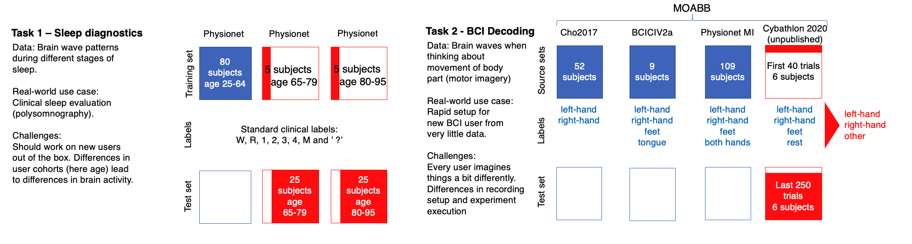

# NeurIPS 2021 BEETL Competition
## Benchmarks for EEG Transfer Learning

Code for the NeurIPS 2021 BEETL Challenge (https://beetl.ai/). The goal of the competition was to develop a method for transfer and meta learning usable for EEG data. The competition had two tasks: 
- Task 1: cross-subject sleep stage decoding 
- Task 2: cross-dataset motor imagery decoding

This solutions scored ?th in final overall score (calculated based on final phase results in both tasks). 

## Overview
Same approach was used in both tasks with different models. 

- Optimizer: AdamW
- Loss: Focal loss with label smoothing, Virtual Adversarial Training
- Augmentations: Random noise
- Weight normalization of linear layers
- Data normalization using standard scaling
- Trained two models with different seeds (42, 2021), average output is used as final prediction

Training is done in 3 stages:
- Stage 1 (base) - train on source data only
- Stage 2 (mixup) - train on source data with supervised mixup using given target data (samples are selected to have same labels) and higher mixup rate (random for each sample with value up to 0.6)
- Stage 3 (mixup_finetuned) - train on source and target data, source data samples are mixed up in unsupervised way using lower mixup rate (random for each sample with maximum value 0.4)

## Training and submission notebooks
Leaderboard testing phase 
Sleep: [src/leaderboard/beetl_sleep_mixup_vat.ipynb](/src/leaderboard/beetl_sleep_mixup_vat.ipynb) 

Final scoring phase 
Sleep: [src/final/beetl_sleep_mixup_vat_v3.ipynb](/src/final/beetl_sleep_mixup_vat_v3.ipynb) 
Motor imagery: [src/final/beetl_mi_mixup_vat.ipynb](/src/final/beetl_mi_mixup_vat.ipynb) 

## Report
Report: [doc/neurips-beetl-2021.pdf](/doc/neurips-beetl-2021.pdf) 

## Output from notebook runs
Leaderboard testing phase sleep: [output/leaderboard/2021-09-29-18-58-sleep-mixup_vat_v2.zip](/output/leaderboard/2021-09-29-18-58-sleep-mixup_vat_v2.zip) 
Final scoring phase sleep: [output/final/2021-10-01-17-09-sleep-mixup_vat_v3.zip](/output/final/2021-10-01-17-09-sleep-mixup_vat_v3.zip) 
Final scoring motor imagery: [output/final/2021-09-30-15-01-mi-mixup_vat.zip](/output/final/2021-09-30-15-01-mi-mixup_vat.zip) 

Output content:
- model states from different stages of training (best_model...pt)
- target and test outputs from different stages (...-target_output.npy, ...-test_output.npy)
- copy of notebook that generated the output (notebook_run.ipynb)
- submission (answer.txt)

## Results
|Phase|Score (position)|
|---|:---|
|sleep leaderboard testing phase|72.14 (1)|
|motor imagery testing phase|45.47 (6)|
|sleep final scoring phase|? (?)|
|motor imagery final scoring phase|? (?)|

## Reproducibility
Notebooks were run on Google Colab (free version) with Tesla K80 GPU, NVIDIA-SMI 470.63.01, Driver Version: 460.32.03, CUDA Version: 11.2 and PyTorch 1.9.0+cu102.  

To rerun the notebooks change:
- GDRIVE_DATA_FOLDER to folder where zipped competition data are located on your gdrive
- GDRIVE_OUTPUT_FOLDER to folder where the run output will be saved after it's done

Expected files for Sleep and Motor imagery:
- Sleep: SleepSource.zip, LeaderboardSleep.zip, finalSleep.zip
- Motor imagery: leaderboardMI.zip, finalMI.zip

## TODO
- clean up and add code of other (not successfull) approaches